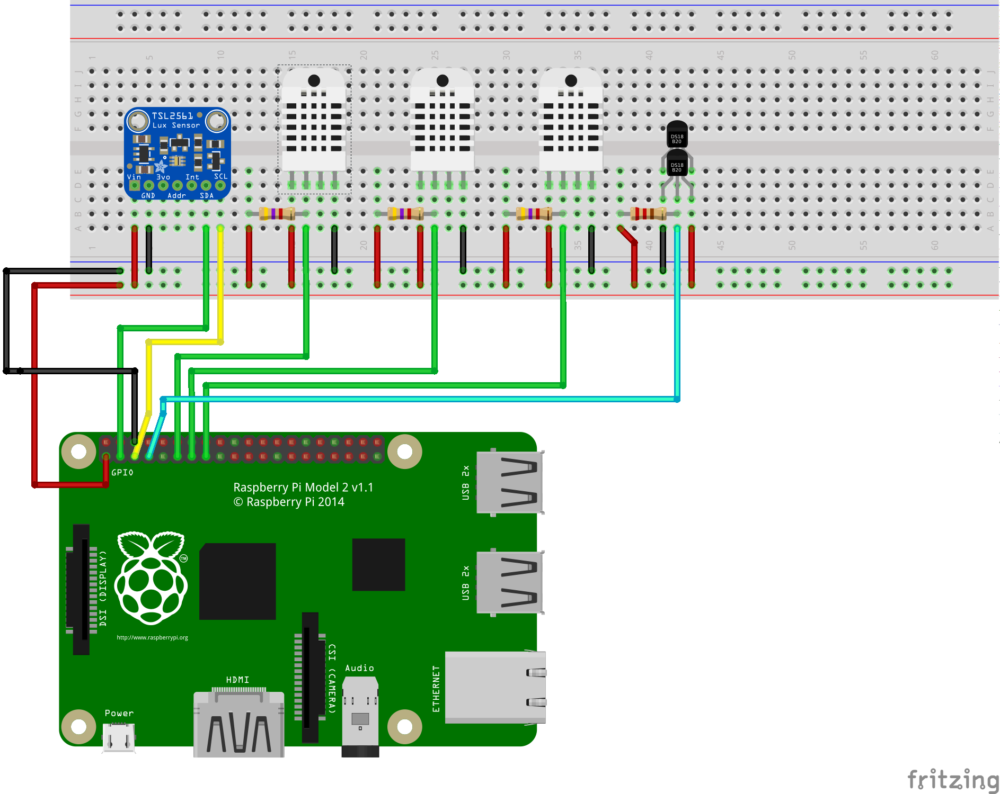

# basement observer

RPI2 with TLS2561 light sensor connected via i2c, 3 lines for DHT22 sensors and a DS1820 1-wire line for multiple sensors.

It fetches the sensors data and publishes to an MQTT topic the following payload:

```JSON
{
  "device_name":"rpi0",
  "sensors":[
    {"name":"dht22_0_hum","data":20.100000381469727},
    {"name":"dht22_0_temp","data":23.799999237060547},
    {"name":"light_sensor","data":4426},
    {"name":"ds1820_0","uuid":"28-0000031e44f8","data":23.3},
    {"name":"ds1820_1","uuid":"28-0000031e7c61","data":23.4},
    {"name":"ds1820_2","uuid":"28-0000031e5f5d","data":23.2}
  ]
}
```

## Schema



## Prerequisites
  - node.js >= 8
  - [raspi-sensors](https://github.com/Vuzi/raspi-sensors)
  - [ds18x20](https://github.com/mraxus/ds18x20.js)

## Install

    npm install

## Usage

    sudo node server.js
